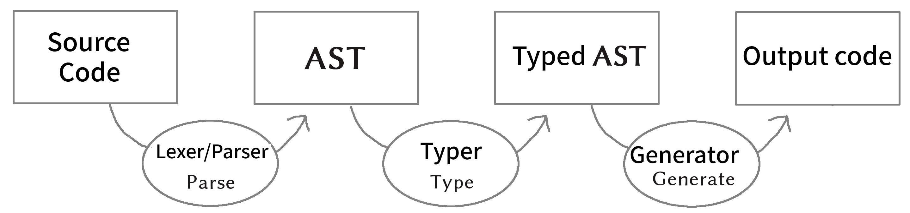

= Haxe practice macro

== Introduction

=== What is this book?

This is an explanation book about Haxe's macros. I will introduce practical examples and tips of macros.

I wanted to publish it on https://techbookfest.github.io/[techbook], but it was rejected, so I published it on Github.

=== What is Haxe?

Haxe is a statically typed programming language. It is characterized by its rich output targets, and it is possible to compile to the following 3 types of bytecode and 8 types of source code.

* bytecode
**Flash
**Neko (for the VM being developed by the Haxe Foundation)
** hl (intermediate language being developed by Haxe Foundation)

* Source code
** JavaScript
**ActionScript3
** C#
**Java
**Python
** C++
**PHP
** Lua

The standard library provides both packages available for all output targets (or multiple targets) and standard libraries for each output target. This allows Haxe to write both cross-platform programs and highly target-dependent programs.

Haxe was originally developed as an alternative to ActionScript, and its syntax is very similar to ActionScript3. However, it is not only similar to ActionScript3, but also has many functions not found in ActionScript3, such as the following.

* type inference
* type parameters (generics)
* enum (generalized algebraic data type, GADT)
* pattern matching
* typedef (type alias)
* Structural subtyping
* array comprehension, map comprehension
* Variable expansion within strings
* macro

This book covers the functionality of macros in detail.


=== How to read this book

This book is not an introductory guide to Haxe, so it does not cover basic Haxe syntax or installation procedures. However, it focuses on what specific problems macros solve so that programmers who don't know Haxe can read it.

Macros are a tricky feature, but they are also a very attractive feature. Even if you don't know Haxe, I hope you can read this book and feel the world.


=== About Haxe version

This book assumes version 3.3.0 RC1 of Haxe.


== macro basics

=== hello, macro

Haxe macros are features that allow Haxe code to manipulate the behavior of the Haxe compiler. See the code below to understand what this means.

``` haxe
import haxe.macro.Context;

class HelloMacro {
     public static function hello():Void {
         Context.error("Something Wrong!?", Context.makePosition({min:0, max:2, file:"HelloMacro.hx"}));
     }
}
```

Save this as ``HelloMacro.hx`` and compile it with the following command.

```
haxe --macro HelloMacro.hello()
```

This argument specifies to call the ``HelloMacro.hello()`` function at the initialization stage of compilation. And this result is a compilation error.

```
HelloMacro.hx:1: characters 0-2 : Something Wrong!?
```

But this is fine. This is the intended behavior. The sample above is instructed to cause a compile error. And it specifies 0 to 2 characters of ``HelloMacro.hx`` file as the error occurrence position.

This is exactly what "manipulating Haxe's compiler behavior with Haxe code" means. Of course, macros don't stop there. You can access and rewrite Haxe's abstract syntax tree (AST), add variables to classes, embed resources, and intervene in various stages of compilation.


=== Haxe compilation process

Macros and compilation are closely related, so it's good to first know how Haxe compiles.

Below is a simple diagram of the compilation process.



When using macros, the process from source to typed AST works twice.

So the first is to read the code of the macro and the second is to print the actual code. Code loaded as macros is used to manipulate each step of the compilation for the actual output.

If you want to load separate code in the same file for macro loading and actual output loading, branch with the ``macro`` compile condition flag.

Let's look at an example.

```haxe
#if macro
class Macro {}
#else
class Main {}
#end
```

When written like this, it will be interpreted as ``class Macro {}`` when the macro is loaded, and as ``class Main {}`` for the actual output.


=== Macro type

There are several types of Haxe macros. This book is divided into the following four types. In parentheses is at what stage compilation for output is performed.

* Initialization macro (initialization stage)
* expression macro (during parsing)
* build macro (during parsing)
* Event handler (``onGenerate`` before generation, ``onAfterGenerate`` after generation)

From the next chapter, we will take a look at what each of these means in concrete terms, together with practical examples.


== initialization macro

We've already seen the initialization macro. That was the first compilation error example. If you specify a function in the compiler option, it will be executed at the initialization stage of compilation.

=== Embedded build date

For example, when developing a smartphone app, you may not know when the version of the app currently on your device was built. In such a case, embedding the build date and time in the development version of the app and displaying it on the screen will allow you to see at a glance which version it is.

Below is a sample that embeds the date and time using the initialization macro and outputs it.

```haxe
import haxe.Resource;
import haxe.io.Bytes;

#if macro
import haxe.macro.Context;
#end

class EmbeddingDate {
    public static var DATE_RESOURCE_KEY = "dateResource";

    #if macro
    public static function initialize():Void {
        // Initialization macro entry point

        // Get the current time into a string
        var dateString = Date.now().toString();

        // Embed string as resource
        Context.addResource(DATE_RESOURCE_KEY, Bytes.ofString(dateString));
    }
    #end

    public static function main():Void {
        // Entry point when running the app

        // Extract build date from resource and output
        trace(Resource.getString(DATE_RESOURCE_KEY));
    }
}
```

Compile this to Neko bytecode with the following options.

``` sh
haxe --macro EmbeddingDate.initialize() -main EmbeddingDate -neko EmbeddingDate.n
```

and run the output file.

``` sh
neko EmbeddingDate.n
```

Then the build date will be output as follows.

```
EmbeddingDate.hx:30: 2016-04-01 00:00:09
```

This time, to pass the information from the macro to the runtime, I used the method of embedding the information with the ``Context.addResource`` function and extracting it with the ``Resource`` function at runtime. This is a pattern often used in macros.

It is convenient to check the build status if you can see the following information other than the time.

  * ``Sys.systemName()`` : OS
  * ``Context.defines()`` : compiler flags

http://code.haxe.org/category/macros/[Cookbook on Haxe official website] also introduces how to call git commands and embed Git commit hash values.

==== Tips: Macros and neko packages

The macro runtime standard library can be used not only in the haxe.macro package and the sys package, but also in the neko package.


=== Remove field, change type, tag

In Haxe, if you want to use a library on the output target side, such as a JavaScript library, in many cases you will need to prepare a type definition file (extern).

If the library you want to use is famous, in many cases someone has already created extern and made it public, so you can use it, but there may be problems at this time. That is when the version of the library you want to use and the version of extern do not match.

In such cases, it is tempting to edit the extern directly, but doing so is troublesome when the original extern is updated.

Third party externs are often not well maintained, so editing the extern yourself is actually a good option. However, if the change you want is only to remove a field, change a metadata tag, or change a type, then an initialization macro is the place to go.

``` haxe
#if macro
import haxe.macro.Compiler;
#end

// extern class
extern class SampleExtern {
     public static function test():Void;
     public static function test2():Void;
     public static function test3():Void;
}

class PatchExtern {
     #if macro
     public static function initialize():Void {
         // Tag SampleExtern.test as deprecated
         Compiler.addMetadata("@:deprecated", "SampleExtern", "test", true);

         // Delete SampleExtern.test2
         Compiler.removeField("SampleExtern", "test2", true);

         // Change the return value of SampleExtern.test3 to String
         Compiler.setFieldType("SampleExtern", "test3", "String", true);
     }
     #else
     public static function main():Void {
         // get a deprecation warning when compiling
         SampleExtern.test();

         // error when trying to access
         // SampleExtern.test2();

         // Since the return value has been changed to String, it can be used as an argument for trace
         trace(SampleExtern.test3());
     }
     #end
}
```

If you fix it with a macro like this, you can follow it relatively easily even if the original extern is updated. Of course, editing such fields is possible for non-extern classes as well.

==== Tips: Patch files

If you need multiple changes, it's good to use a patch file. The patch that has the same meaning as the previous example is as follows.

```
@:deprecated static SampleExtern.test
-static SampleExtern.test2
static SampleExtern.test3 : String
```

Save this as a file named ``sample.patch`` and apply it with ``Compiler.patchTypes`` from the macro.

```
     public static function initialize():Void {
         Compiler.patchTypes("sample.patch");
     }
```

If the fields you want to change are not ``static``, simply remove each ``static`` from the patch file and it will work.

=== include

Normally, Haxe compiles by specifying a class that has a main function with the ``-main`` compile option, but in fact it is possible to compile without this specification. This section introduces how to specify the compilation target from the initialization macro.


``IncludeMacro.hx``
``` haxe
import haxe.macro.Compiler;

class IncludeMacro {
     public static function initialize():Void {
         // Specify all types under the lib package for compilation
         Compiler.include("lib", true);
     }
}
```


``lib/IncludeSample.hx``
``` haxe
package lib;

class IncludeSample {
     public function new() {
         trace(Math.random());
     }
}
```

Using the above two files, compile to JavaScript with the following command.

```
haxe -js lib.js --macro IncludeMacro.initialize()
```

Then the following JavaScript will be generated.

``` javascript
(function (console) { "use strict";
var lib_IncludeSample = function() {
     console.log(Math.random());
};
})(typeof console !== "undefined" ? console : {log:function(){}});
```

You can see that the compilation was successful without specifying a main class and the lib.IncludeSample class is included in the output.

This method of specifying compilation targets is useful when you want to create a JavaScript library with Haxe. Haxe has a dead code removal function that removes code that cannot be reached from the main function from the output code, but if you specify like the above, the entire package is included in the output and unused code is removed from it. They will do it for you.


==== Tips: @:expose

Classes and functions output from Haxe to JavaScript cannot be accessed from JavaScript by default. Add the ``@:expose`` tag to classes and functions that you want to access from JavaScript.

``` haxe
@:expose
class IncludeSample {
```

Then you can call ``new lib.IncludeSample()`` and ``IncludeSample`` fields from JavaScript.


==== Tips: Include in a single file

If you want to include a single file instead of the whole package, simply specify the file's path on the command line.

```
haxe lib.IncludeSample lib.IncludeSample2
```


=== exclude

If you want to use an external library in a JavaScript target, you will often use a library written directly in JavaScript or a library written in Haxe as it is. I want to

For example, if you want to write both a library itself and a plugin for it in Haxe. In this case, if you simply compile the plugin that depends on the body code, the body code will be included in the plugin.

In such a case, you can remove the body code from the output by using ``exclude`` in the initialization macro. The following is a sample that ``exclude`` with code that depends on ``lib.IncludeSample``.

``` haxe
import lib.IncludeSample;

#if macro
import haxe.macro.Compiler;
#end

class ExcludeSample {
     public function new() {
         new IncludeSample();
     }

     #if macro
     public static function initialize():Void {
         // Don't include the lib package and below in the output result
         Compiler.exclude("lib");
     }
     #end
}
```

Compile this.

``` sh
haxe ExcludeSample -js exclude_test.js --macro ExcludeSample.initialize()
```

will output:

``` javascript
(function (console) { "use strict";
var ExcludeSample = function() { };
ExcludeSample.main = function() {
     new lib.IncludeSample();
};
})(typeof console !== "undefined" ? console : {log:function(){}});
```

It's true that ``lib.IncludeSample`` is being called, but I was able to generate code that doesn't include the implementation of ``lib.IncludeSample`` itself.

==== Tips: --gen-hx-classes

There is also ``--gen-hx-classes`` as a function that can realize the relationship between this body and plugins. You can generate the ``extern`` from your source code by running Haxe's compiler with the ``--gen-hx-classes`` option.

This function can generate ``extern`` from target libraries such as jar and swc, so it is often used for that purpose.


==== Tips: Initialization macros and haxe.macro.Compiler

Even if the function specified by the initialization macro is not a self-made function, it is possible to directly specify a standard library function. In other words, the ``exclude`` example has the same effect as the command below.

``` sh
haxe ExcludeSample -js exclude_test.js --macro haxe.macro.Compiler.exclude('lib')
```

In addition, the class name can be omitted when using functions of the ``haxe.macro.Compiler`` class.

``` sh
haxe ExcludeSample -js exclude_test.js --macro exclude('lib')
```


== expression macro

An expression macro is a macro that can be used like a function call. Takes a Haxe expression and transforms it into another expression.

=== repeat process twice

To understand what an expression macro looks like, let's write a macro that does the same thing twice.

``` haxe
import haxe.macro.Context;
import haxe.macro.Expr;

class ExprMacro {
     public static macro function twice(expr:Expr):Expr {
         return {
             expr: ExprDef.EBlock([expr, expr]),
             pos: Context.currentPos(),
         }
     }
}
```

It looks like a normal function definition, but the ``macro`` modifier indicates that this function is an expression macro. ``haxe.macro.Expr`` used for arguments and return values is a structure that represents the abstract syntax tree (AST) of Haxe. It consists of an enum representing the type of element and information about where in the code the element came from. This macro generates and returns a block expression that repeats the given expression twice. ``Context.currentPos()`` is the position information of the call point of this function, and it is assigned as the position information of the generated block expression.

I will try to use this macro.

``` haxe
class ExprMacroSample {
     static function main() {
         var i = 0;
         ExprMacro.twice(i += 4);
         trace(i); // 8
     }
}
```

At compile time, the ``ExprMacro.twice`` function is passed the expression syntax tree for ``i += 4`` and generates a block expression that repeats it. In other words, the ``main`` function is rewritten as follows during the compilation process.

``` haxe
     static function main() {
         var i = 0;
         {
             i += 4;
             i += 4;
         }
         trace(i); // 8
     }
```

==== Tips: Types that can be used as arguments

In addition to the ``Expr`` type, basic types, string types, and their arrays can be used as arguments of macro functions. Given these types, you can receive their values by writing and passing their literals. Also, if ``Array<Expr>`` is specified as the last argument, ``Expr`` can be received as a variable length argument.


==== Tips: Layfication

It's troublesome to have to write ``ExprDef.EBlock`` or ``Context.currentPos`` to create a single block expression. Haxe macros provide a syntax for writing such a ``haxe.macro.Expr`` structure more easily. That is Reification.

Let's rewrite the previous ``twice`` using refication.

``` haxe
     public static macro function twice(expr:Expr):Expr {
         return macro {
             $expr;
             $expr;
         }
     }
}
```

It's easier than the original code to express a block expression that repeats the given expression twice. Reification can be used in the form of ``macro expressions``. If you write Haxe code directly after ``macro``, it will return ``haxe.macro.Expr``. ``$`` is an escape symbol, and ``$expr`` specifies to use the expression stored in the ``expr`` variable at that position.

The following types of escapes are available.

[format="csv",options="header"]
|======
,Type,Description
``${}``、``$e{}``,``Expr\->Expr``,``{}``Evaluate the contents of and expand to that position
``$a{}``,``Array<Expr>\->Array<Expr> or Array<Expr>\->Expr``,"``Array<Expr>`` is written at the expected position, the value is expanded at that position. At the position where ``Expr`` is expected, it is converted into an array declaration expression and expanded."
``$b{}``,``Array<Expr>\->Expr``,block type.
``$i{}``,``String\->Expr``,Generate an identifier from a string.
``$p{}``,``Array<String>\->Expr``,Field access expression.
``$v{}``,``Dynamic\->Expr``,"Generates a literal expression for that value. Works with primitive types, instances of enums, and arrays of them."
``object.$name``,``String\->Expr``,field access.
``var $name = 1;``,``String\->Expr``,Variable declaration.
``function $name () {}``,``String\->Expr``,a function declaration.
``{ $name : 1 }``,``String\->Expr``,Object literal.
``try e() catch($name:Dynamic) {}``,``String\->Expr``,try-catch
``new $typePath()``,``TypePath\->Expr``,instantiation.
``@:pos(p)``,``Position``as an argument, replace the positional information of the expression with `p`.
|======

=== Time measurement

Now that we've seen the behavior and specifications of expression macros, let's take a look at how expression macros can be useful in real life.

If you want to casually measure the time in a part of the program, you often write code that records the time in a local variable and takes the difference in time after processing is finished.

``` haxe
class BenchmarkSample {
     static function main() {
         var time = Date.now().getTime();

         // something that takes a long time
         for (i in 0...100000) {}

         trace((time - Date.now().getTime()) + "ms");
     }
}
```

However, it is long and cumbersome to write many times. Therefore, if you define the following macro, you can easily measure the time.

``` haxe
import haxe.macro.Expr;

class ExprMacro {
     public static macro function bench(target:Expr):Expr {
         return macro {
             var time = Date.now().getTime();
             $target;
             trace((time - Date.now().getTime()) + "ms");
         }
     }
}
```

As a result, the original time measurement code can be rewritten in the following function call format.

``` haxe
     static function main(): Void {
         ExprMacro.bench(
             for (i in 0...100000) {}
         );
     }
```

No more troublesome descriptions, and now you can easily measure time.


==== Tips: How to debug expressions
``haxe.macro.Printer`` is convenient for checking whether the expression macro you wrote is generating the correct expression. ``haxe.macro.Printer`` is a module that converts expressions and type instances into strings of Haxe code.


==== Tips: Non-static macros

Since most expression macros found in the Haxe manual, Github, etc. are defined as ``static``, it is easy to misunderstand that expression macros can only be defined as ``static`` functions, but that is not the case. is not.

You can also define non-static expression macros like this:

``` haxe
import haxe.macro.Expr;

class NonStaticSample {
     public function new() {}
    
     #if !macro
     public static function main() {
         var array = new NonStaticSample().test();
     }
     #end
    
     private macro function test(self: Expr): Expr {
         return macro [$self, $self];
     }
}
```

In this case, call the non-static expression macro with one less defined argument, as in the example above. This will take the expression on the left side of ``.test()`` as the first argument. In other words, ``new NonStaticSample().test()`` is converted to ``[new NonStaticSample(), new NonStaticSample()]``.


=== Debug trace for local variables

When researching bugs, you may want to know the state of variables at some point in time. In such cases, it is convenient to use macros to trace local variables together.

In Haxe, you can get a list of local variables defined at the macro call location with the `Context.getLocalTVars()` function. Use this to define a macro like this:

``` haxe
import haxe.macro.Context;
import haxe.macro.Expr;

class DebugMacro {
     public static macro function debug() {
         var exprs:Array<Expr> = [];
         for (tvar in Context.getLocalTVars()) {
             // Generate an expression that adds the string "variable name: variable contents" to the variable str
             var expr = macro str += $v{tvar.name} + " : " + $i{tvar.name} + "\n";
             exprs.push(expr);
         }
        
         // get the name of the calling function
         var methodName = Context.getLocalMethod();
        
         // Define the variable str and convert the array of prepared expressions into a block expression
         return macro {
             var str = "Called from " + $v{methodName} + "\n";
             $b{exprs}
             trace(str + "--------\n");
         };
     }
}
```

And then call this ``debug`` function like this:

``` haxe
class DebugMacroSample {
     public static function main() {
         test(100);
     }
    
     public static function test(hoge:Int) {
         var fuga = "ok";
         DebugMacro.debug();
     }
}
```

The result is

```
DebugMacroSample.hx:20: Called from test
fuga: ok
hoge: 100
--------
```

I was able to display the list of local variables of the ``test`` function that called it. If you output the fields of the ``this`` instance together with these, it will be a powerful tool for investigating the situation when a bug occurs.


==== Tips: Debugging functions on the output target side

Haxe often supports debugging functions on the target side, so if you use that as well, you can investigate bugs. For example, for Flash targets FlashDevelop supports stepping and breakpoints. In the case of JavaScript, you can use breakpoints (debugger statements) in the ``js.Lib.debug()`` function, and you can see the line where execution errors occur in the source map from the location of the Haxe source code. .


==== Tips: Describing Errors

When writing an expression macro, it is important to write error handling as carefully as possible for the expression given as an argument. Expression macros are very hard to debug if expressions that should be in error are not. As introduced in the sample at the beginning, macros can generate warnings and errors, so it's a good idea to use them proactively.

However, the Haxe compiler does not support the output of UTF-8 strings, and if an error is output in Japanese (at least on Windows) the characters will be garbled, so be careful.


== build macro

A build macro is a macro that adds or removes variables or functions from a class. You can call classes with metadata tags.


=== auto-generate constants

A typical use case for build macros is the automatic generation of constant fields. Below is a sample that searches for a file in a folder at compile time and defines the file name as a constant.

``` haxe
import haxe.macro.Context;
import haxe.macro.Expr;
import haxe.macro.Printer;
import sys. FileSystem;

class BuildMacro {
     public static function addFileNames(directory:String):Array<Field> {
         var fields:Array<Field> = [];
        
         // loop over the files in the directory
         for (fileName in FileSystem.readDirectory(directory)) {
             // create a constant expression representing the file name
             var expr = macro $v{fileName};
            
             // Define and add fields.
             // public static inline var uppercase filename = "filename";
             // means
             fields. push({
                 name : StringTools.replace(fileName, ".", "_").toUpperCase(),
                 access : [Access.APublic, Access.AStatic, Access.AInline],
                 // If you specify null for the type, it will be inferred. The value is a constant expression representing the file name
                 kind : FieldType.FVar(null, expr),
                 // use the location information from the function caller
                 pos : Context.currentPos(),
                 // add documentation comment
                 doc : new Printer().printExpr(expr),
             });
         }
        
         return fields;
     }
}
```

Call this with a class with the ``@:build`` metadata.

``` haxe
@:build(BuildMacro.addFileNames("./assets"))
class Constants {}
```

As a result, the directory in the ``./assets`` position is searched from the working directory at the time of compilation, and the file name constant directly under it is generated as the ``static`` field of ``Constants``. increase. It is available like this:

``` haxe
class ConstantsSample {
     public static function main() {
         trace(Constants.SAMPLE_TXT); // ConstantsSample.hx:3: sample.txt
     }
}
```

This may seem like more work than simply using ``"sample.txt"`` in a string literal, but constantization has two advantages.

The first is that "trying to specify a file name that does not exist will result in a compilation error". This prevents typos, and if you change the file name, you'll quickly know where to fix in your code.

The second is that "code completion on the editor works". This is because the Haxe compiler itself provides functionality for editor completion, and many IDEs and editors use it. In other words, completion is done after adding the field by the macro. For this reason, even if you have to enter a long file name, you can easily enter it without checking with your eyes or copying and pasting.

There are many ways to automatically generate constants with ``@:build``, such as not only file names, but also JSON, CSV, HTML, and CSS data.


==== Tips: Macros and documentation generation

Haxedoc and dox are so-called document generation tools that correspond to Javadoc for Java and JSDoc for JavaScript. When generating documentation with these tools, fields added using build macros are included in the output as well. This is because the xml output for document generation also uses the functionality that Haxe's compiler has.

So if you want to generate many fields with a macro and check them in a list, it may be better to use a document generator such as dox.

You can also inject documentation comments from your build macros. When you generate a complicated expression, if you convert the generated ``Expr`` instance to a string with ``haxe.macro.Printer`` and use it as it is as a document comment, what kind of expression is actually generated? It is convenient to be able to visualize whether it is being done.

This is also done in the constant generation mentioned earlier.

Documentation comments added in this way can be used not only for documentation generation, but also displayed on IDEs that use the compiler's completion function.

image::/resources/images/completion.png[Completion with FlashDevelop]


==== Tips: #if display

The fact that the execution result of the macro is reflected in the input completion means that the input completion will be slower if the macro performs heavy processing. The ``display`` conditional flag is useful if you want to prevent slow completion.

If you surround heavy macro code with ``#if !display`` ~ ``#end``, the code in that range will be ignored by Haxe's auxiliary functions.


=== trace function calls

Another practical example of build macros is a macro that adds a ``trace`` call to the beginning of every function in a class with the function name and argument contents. Defining such macros makes it easy to track the order in which functions are called.

``` haxe
import haxe.macro.Context;
import haxe.macro.Expr.Field;
import haxe.macro.Expr.FieldType;
import haxe.macro.Type.FieldKind;

class BuildMacro {
     public static function methodTrace():Array<Field> {
         // get already defined fields
         var fields = Context.getBuildFields();
        
         for (field in fields) {
             switch (field.kind) {
                 case FieldType.FFun(func):
                     // prepare expression for trace
                     var traceArg = macro "auto trace: " + $v{field.name} + "(";
                    
                     // also add arguments for trace
                     var first = true;
                     for (arg in func.args) {
                         if (!first) {
                             traceArg = macro ${traceArg} + ",";
                         }
                         traceArg = macro ${traceArg} + $i{arg.name};
                         first = false;
                     }
                    
                     traceArg = macro ${traceArg} + ")";
                    
                     // insert a trace statement before executing the original expression
                     func.expr = macro {
                         trace(${traceArg});
                         ${func.expr};
                     }
                    
                 case_:
                     // Do nothing but functions.
             }
         }
        
         return fields;
     }
}
```

Use it like this:

``` haxe
@:build(BuildMacro.methodTrace())
class TraceSample {
     public static function main():Void {
         for (i in 0...2) {
             for (j in 0...3) {
                 test(i, j);
             }
         }
     }
    
     public static function test(i:Int, j:Int):Void {}
}
```

The execution result is as follows.

```
BuildMacro.hx:31: auto trace: main()
BuildMacro.hx:31: auto trace: test(0,0)
BuildMacro.hx:31: auto trace: test(0,1)
BuildMacro.hx:31: auto trace: test(0,2)
BuildMacro.hx:31: auto trace: test(1,0)
BuildMacro.hx:31: auto trace: test(1,1)
BuildMacro.hx:31: auto trace: test(1,2)
```

In this example, we simply output the function names, but if you record more details, you can use it for various profiling purposes, such as examining classes that call many functions or discovering functions that take a long time to execute. increase.

In addition, such a build macro can be applied to classes in the package at once from the initialization macro with the ``addGlobalMetadata`` function of ``haxe.macro.Compiler``. .


==== Tips: Measuring compilation time

If you want to know how long it takes to process a macro, you can use the ``--times`` compiler argument to print the time spent on each step of compilation. In addition, the ``-D macro_times`` option will display a breakdown of the time each macro process takes.


== event handler

By registering event handlers from initialization macros, expression macros, and build macros, processing can be performed later.

``onGenerate`` is executed after all types have been parsed and typed. Here you can receive all types of information (including typed abstract syntax trees) in an array. ``onAfterGenerate`` will be executed later and you can access the output file.


=== Create Linter (onGenerate)

All types included in the compilation target are passed as arguments to the handler registered with ``onGenerate``. From this type, we can access all typed ASTs, but changes to this AST are limited to changing metadata tags.

Examples of things that can be done at the timing of ``onGenerate`` are as follows.

* Embed strings and binaries with metadata tags or ``Context.addResource``.
* Analyze ``Type`` information and output compiler warnings and errors.

Here, a compiler warning is generated based on the ``Type`` information. I will introduce how to create a so-called Linter.

Below is a Linter that checks that variable names are lower camel case

``` haxe
import haxe.macro.Context;
import haxe.macro.Type;

class Linter {
     // for calling as initialization macro
     public static function initialize():Void {
         Context.onGenerate(lint);
     }
    
     private static function lint(types:Array<Type>):Void {
         for (type in types) {
             switch (type) {
                 case Type.TInst(ref, _):
                     var classType = ref.get();
                     lintFields(classType.statics.get());
                     lintFields(classType.fields.get());
                    
                 case Type.TAbstract(ref, _):
                     var abstractType = ref.get();
                     lintFields(abstractType.array);
                    
                 case_:
             }
         }
     }
    
     // checks against fields
     private static function lintFields(fields:Array<ClassField>):Void {
         for (field in fields) {
             switch (field.kind) {
                 case FieldKind.FVar(VarAccess.AccInline, _):
                     // Exclude inline variables from checking
                    
                 case_:
                     // Determine if the case of the field name is strange.
                     if (!isValidFieldName(field.name)) {
                         Context.warning("should be lower camlcase", field.pos);
                     }
             }
         }
     }
    
     // check that variable names are lower camel case
     private static function isValidFieldName(name:String):Bool {
         if (StringTools.startsWith(name, "get_") || StringTools.startsWith(name, "set_")) {
             // exclude suffixes for getters and setters
             name = name.substr(4);
         } else {
             // leading _ is allowed
             while (name.substr(0, 1) == "_") {
                 name = name.substr(1);
             }
         }
        
         if (name.length == 0) { return false;
        
         // check for non-snake case
         if (name.indexOf("_") != -1) { return false;
        
         // check for lower case start
         var charCode = name.charCodeAt(0);
         if (charCode < 97 || 122 < charCode) { return false;
        
         return true;
     }
}
```

For example, use this with a class like this:

``` haxe
class LintSample {
     public static function main():Void {
         Test();
         test_test();
     }
    
     // capitalized
     public static function Test():Void {}
    
     // snake case
     public static function test_test():Void {}
}
```

This will result in the following warning:

```
LintSample.hx:10: characters 15-38 : Warning : should be lower camlcase
LintSample.hx:13: characters 15-43 : Warning : should be lower camlcase
```

In reality, this code will also issue warnings for standard libraries such as ``Math.NaN``, so it is necessary to devise ways to limit the target packages, etc., but you can apply this method. You can perform a variety of static code analyzes, such as cyclomatic complexity checks.


==== Tips: Type and haxe.macro.Type

So far, we've been using ``import`` of the module ``haxe.macro.Type``, but apart from this, the Haxe library has a top-level module ``Type``. If you use both, simply ``import`` ``haxe.macro.Type`` and you won't be able to use the top-level ``Type``. There are two ways to avoid this.

* Use ``haxe.macro.Type`` without ``import`` and specifying the full path each time.
* Use ``import`` with an alias like ``import haxe.macro.Type in MacroType``.


=== Add license information to output (onAfterGenerate)

``onAfterGenerate`` works after the output has already finished. So you can't do anything to intervene in the compilation so far, but instead you can read and write the output file directly.

An example where onAfterGenerate is useful is writing license information to the output file.

Below is an example that writes a comment about the license at the top of the ``js`` target's output file.

``` haxe
import haxe.macro.Compiler;
import haxe.macro.Context;
import sys.io.File;

class LicenseWriter {
     // for calling as initialization macro
     public static function initialize():Void {
         Context.onAfterGenerate(write);
     }
    
     private static function write():Void {
         var fileName = Compiler.getOutput();
         var comment = "/*This is MIT License.*/\n";
        
         File.saveContent(fileName, comment + File.getContent(fileName));
     }
}
```

== Conclusion

=== To learn more about Haxe

Here are some references to help you learn more about Haxe macros.

First of all, there are some macros that are officially provided by Haxe.

* Manual: http://haxe.org/manual/macro.html
* Cookbook: http://code.haxe.org/category/macros/
* API reference: http://api.haxe.org/haxe/macro/index.html

(Japanese translation of the manual: https://github.com/HaxeLocalizeJP/HaxeManual)

Recently, the officially provided materials have been enriched, but it is not the case that exhaustive explanations are provided. For example, the patchType specification is undocumented.

If you want to learn more about macros, reading the source code of Haxe's standard library of macros and third-party libraries that use macros is a good idea.

Examples of third parties using macros include:

*hxsl https://github.com/ncannasse/hxsl
** A library that reads code written in Haxe as AST using a build macro and converts it to AGAL (Flash shader language) bytecode at compile time.
* mcover https://github.com/massiveinteractive/mcover
** Test coverage instrumentation library. From the initialization macro, the build macro is applied to each class at once, and the code for coverage measurement is inserted.

=== E-books using asciidoc

I referred to http://azu.github.io/promises-book/[Book of JavaScript Promises] to create an e-book (PDF) using asciidoc.
